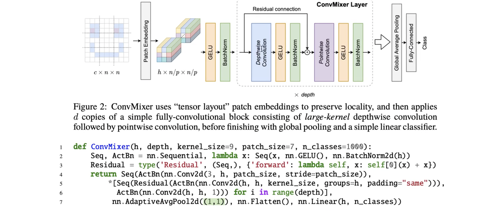

# ConMixer

- VIT还是比较依赖大量数据

- Swin-Transformer已经真正超越CNN
- 使用patch作为输入
- 使用patch作为输入的核心思想就是还是使用convolution,使得stride_step与kernel_size相等,假设这个量为p,这样一个[C , N ,N]的图片经过patch embbeding之后就会变为[h , n/p , n/p]

# <font color = 'red'>Patch+convolution依旧能取得很棒的结果</font>

## ConMixer架构与核心代码实现




- 很重要的一点 ConvMixer为什么将标准卷积拆解为pointwise-convolution和depthwise-convolution,因为这样做可以将标准convolution的计算参数量减少一半

- 举个例子

  - 1.使用标准convolution

    ```python
    import torch
    import torch.nn as nn
    in_channels = 3
    out_channels = 3
    kernel_size = 3
    conv_standard = nn.Conv2d(in_channels, out_channels, kernel_size, padding="same")
    for p in conv_standard.parameters():
        print(torch.numel(p))
        
        
        
    # 输出:这一层一共81+3个参数
    81
    3
      
    ```

  - 2.使用depth-convolution

    ```python
    conv_depth = nn.Conv2d(in_channels, out_channels, kernel_size, groups = 1,padding="same")
    for p in conv_depth.parameters():
        print(torch.numel(p))
        
     
    # 输出:这一层一共27+3个参数
    27
    3
    ```

  - 3.使用point-convolution

    ```python
    conv_point = nn.Conv2d(in_channels, out_channels, 1)
    for p in conv_point.parameters():
        print(torch.numel(p))
        
    
    # 输出:这一层一共9+2个参数
    9
    3
    ```

- 84 = (30+12) * 2

- <font color = 'puple'>所以说使用标准convolution比mixer后的depth-convolution与pointwise-convolution的计算参数量要多一倍</font>