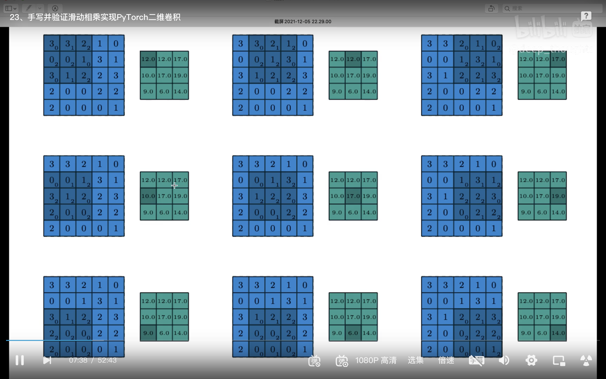
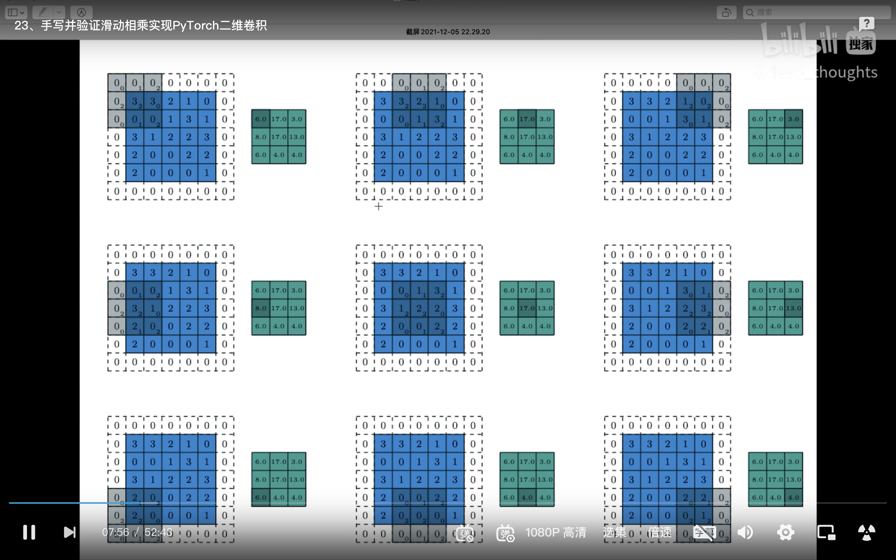
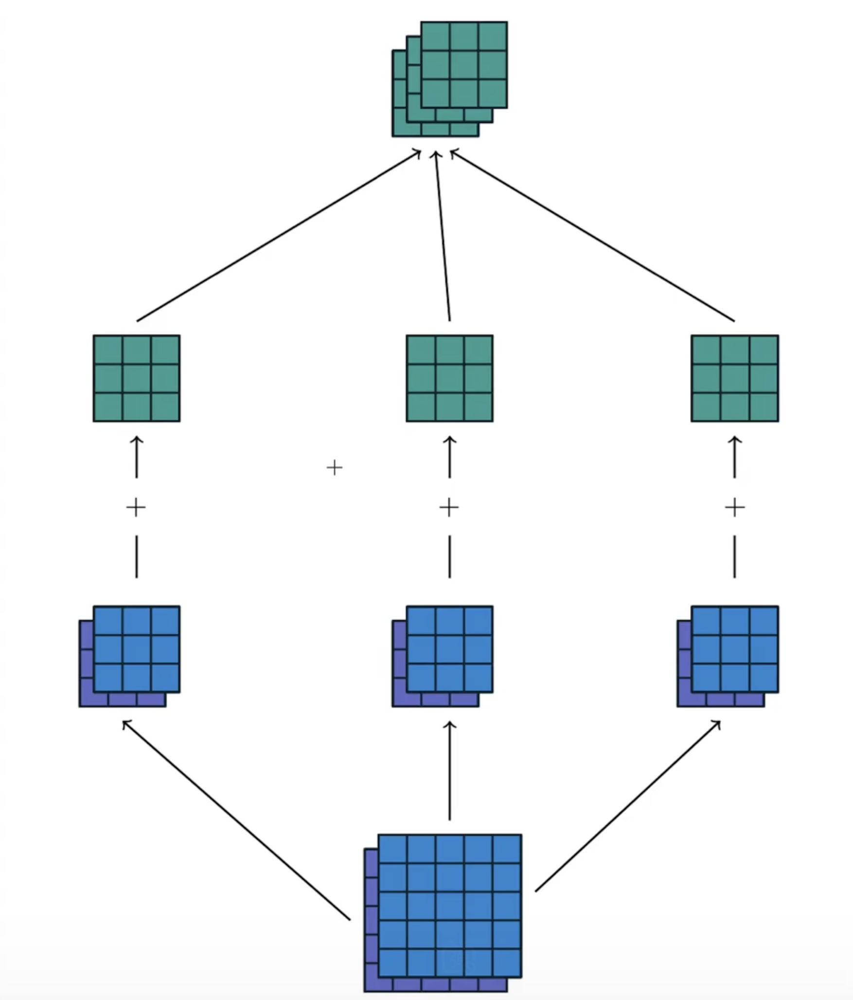

#  手写2D卷积实现(不完整代码)

- 先不考虑batch_size和channels维度
- 卷积运算后，输出feature_map的大小与输入feature_map、kernel的关系式

```python
#output_h = math.floor((input_h - kernel_h)/stride) + 1
#output_w = math.floor((input_w - kernel_w)/stride) + 1

# 增加padding后计算方式(padding=p)
#output_h = math.floor((input_h+2p - kernel_h)/stride) + 1
#output_w = math.floor((input_w+2p - kernel_w)/stride) + 1
```

- 代码

```python
import torch
import torch
import torch.nn as nn
import torch.nn.functional as F
import math
in_channels=1
out_channels=1
kernel_size=3
bias=False
batch_size=1
input_size = [batch_size, in_channels, 4, 4]

conv_layer = nn.Conv2d(in_channels,out_channels,kernel_size,bias=bias)
input_feature_map = torch.randn(input_size)
output_feature_map = conv_layer(input_feature_map)
output_feature_map1 = F.conv2d(input_feature_map,conv_layer.weight)


input=torch.randn(5,5)    # 卷积输入特征图
kernel = torch.randn(3,3) # 卷积核矩阵
bias = torch.randn([1])   # bias与out_channel有关系,输出一个维度的channel与一个标量bias进行相加

# 此函数没有考虑batch_size和channels维度
def matrix_multiplication_for_convolution2D(input,kernel,bias=0,stride=1,padding=0):
    if padding > 0:
        input = F.pad(input,[padding,padding,padding,padding])

    (input_h,input_w) = input.shape
    (kernel_h,kernel_w) = kernel.shape

    output_h = math.floor((input_h-kernel_h)/stride)+1
    output_w = math.floor((input_w - kernel_w) / stride) + 1
    output = torch.zeros(output_h,output_w)

    for i in range(0,input_h-kernel_h+1,stride):
        for j in range(0,input_w-kernel_w+1,stride):
            region = input[i:i+kernel_h,j:j+kernel_w]
            output[int(i/stride),int(j/stride)] = torch.sum(region * kernel) + bias
    return output
 
diy = matrix_multiplication_for_convolution2D(input=input,\
                                              kernel=kernel,\
                                              bias=bias,\
                                              padding=1)

api = F.conv2d(input.reshape((1,1,input.shape[0],input.shape[1])),\
               kernel.reshape((1,1,kernel.shape[0],kernel.shape[1])),\
               padding=1,\
               bias=bias)


print(diy)
print(api)

```

- 输出

```bash
tensor([[-1.2420, -1.2870,  0.6560,  2.9056,  0.4328],
        [ 1.2035,  2.2219,  0.1309, -0.4930,  5.4011],
        [ 1.5556, -2.8066, -0.6927, -0.2931,  1.9322],
        [-1.6737,  1.9562,  0.2099, -1.0972,  1.5454],
        [-0.5166, -0.8533,  0.9155,  4.4129, -0.4408]])
tensor([[[[-1.2420, -1.2870,  0.6560,  2.9056,  0.4328],
          [ 1.2035,  2.2219,  0.1309, -0.4930,  5.4011],
          [ 1.5556, -2.8066, -0.6927, -0.2931,  1.9322],
          [-1.6737,  1.9562,  0.2099, -1.0972,  1.5454],
          [-0.5166, -0.8533,  0.9155,  4.4129, -0.4408]]]])
```


# 一些值得参考的卷积示意图

- channel=1,padding=0



- channel=1,padding=1



- channel=2,padding=0



# 手写2D卷积实现(完整代码)

- 这个demo增加了batch 以及输入channel维度

```PYTHON
import torch
import torch
import torch.nn as nn
import torch.nn.functional as F
import math

def matrix_multiplication_for_convolution2D_full(input,kernel,bias=0,stride=1,padding=0):
    if padding > 0:
        input = F.pad(input,[padding,padding,padding,padding])

    (bs,in_channel,input_h,input_w,) = input.shape
    (out_channel,in_channel,kernel_h,kernel_w) = kernel.shape

    if bias == None:
        bias = torch.zeros(out_channel)

    output_h = math.floor((input_h-kernel_h)/stride)+1
    output_w = math.floor((input_w - kernel_w) / stride) + 1
    output = torch.zeros(bs,out_channel,output_h,output_w)


    for ind in range(bs):
        for oc in range(out_channel):
            for ic in range(in_channel):
                for i in range(0,input_h-kernel_h+1,stride):
                    for j in range(0,input_w-kernel_w+1,stride):
                        region = input[ind,ic,i:i+kernel_h,j:j+kernel_w]
                        output[ind,oc,int(i/stride),int(j/stride)] += torch.sum(region * kernel[oc,ic])
            output[ind, oc] += bias[oc]

    return output

input = torch.randn(2,2,5,5)
kernel = torch.randn(3,2,5,5)
bias = torch.randn(3)

api = F.conv2d(input,kernel,bias=bias,padding=1,stride=2)
diy = matrix_multiplication_for_convolution2D_full(input=input,kernel=kernel,bias=bias,padding=1,stride=2)


print(api)
print(diy)

print(torch.allclose(api,diy))


```

- 代码输出

```PYTHON
tensor([[[[ 5.7473,  2.6327],
          [-0.5777,  0.1411]],
         [[ 0.9600,  2.3656],
          [-2.6877,  4.3586]],
         [[-0.7109, -1.8111],
          [ 4.8116, 11.1469]]],
        [[[10.4999,  0.2339],
          [ 6.8183, -2.8191]],
         [[-4.7422, -7.1585],
          [ 0.9585,  2.4959]],
         [[-6.5928,  9.5195],
          [ 2.9425,  3.2770]]]])
tensor([[[[ 5.7473,  2.6327],
          [-0.5777,  0.1411]],
         [[ 0.9600,  2.3656],
          [-2.6877,  4.3586]],
         [[-0.7109, -1.8111],
          [ 4.8116, 11.1469]]],
        [[[10.4999,  0.2339],
          [ 6.8183, -2.8191]],
         [[-4.7422, -7.1585],
          [ 0.9585,  2.4959]],
         [[-6.5928,  9.5195],
          [ 2.9425,  3.2770]]]])
True
```

