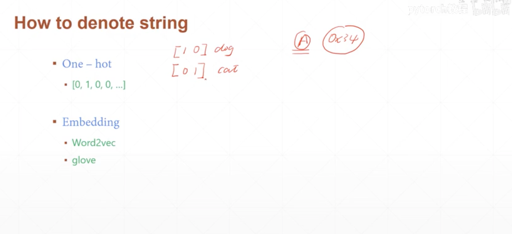

# 14.14 张量数据类型





## 举例说明

- 1.我们随机初始化一些真正的tensor(值得记忆的是,pytorch中默认的tensor类型是:torch.FloatTensor),值得注意的是这个是标准的tensor,是存在<FONT COLOR = "RED">dimension</FONT>这个概念的

```
arr1 = torch.randn(3)
print(arr1)
print(arr1.type())
print(isinstance(arr1,torch.FloatTensor))

输出结果:
tensor([-0.8570, -0.1131, -0.4108])
torch.FloatTensor
True
```

- 2.在pytorch中使用标量

```
print(torch.tensor(1.3))
print(type(torch.tensor(1.3)))


输出结果:
tensor(1.3000)
<class 'torch.Tensor'>
```

```
a = torch.tensor(2.2)
print(a)
print(a.shape)
print(len(a.shape))
print(a.size())

输出结果:
tensor(2.2000)
torch.Size([])
0
torch.Size([]) 
# 可以看到的是已经不存在dimension这个概念了,一般情况下在损失函数中会使用torch.tensor进行存储
```

