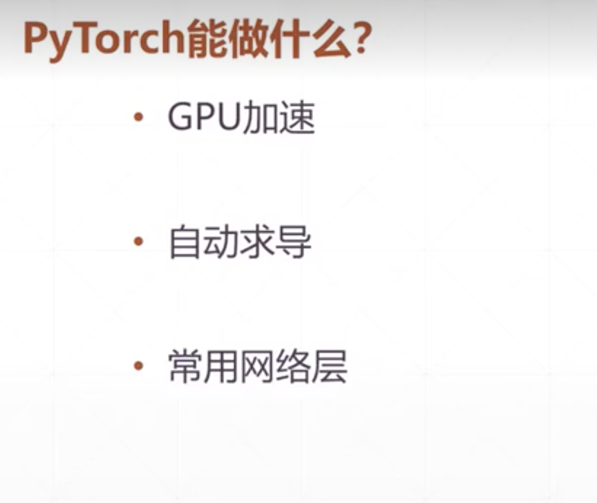

## 关于Pytorch的背景		

### 

#### Pytorch能做什么



#### 自动求导

```python
import torch
from torch import autograd

x = torch.tensor(1.)
a = torch.tensor(1.,requires_grad=True)
b = torch.tensor(2.,requires_grad=True)
c = torch.tensor(3.,requires_grad=True)

y = a**2 + b*x+c
print("before:",a.grad,b.grad,c.grad)
grads = autograd.grad(y,[a,b,c])
print("after:",grads[0],grads[1],grads[2])


# 输出
before: None None None
after: tensor(2.) tensor(1.) tensor(1.)

```

